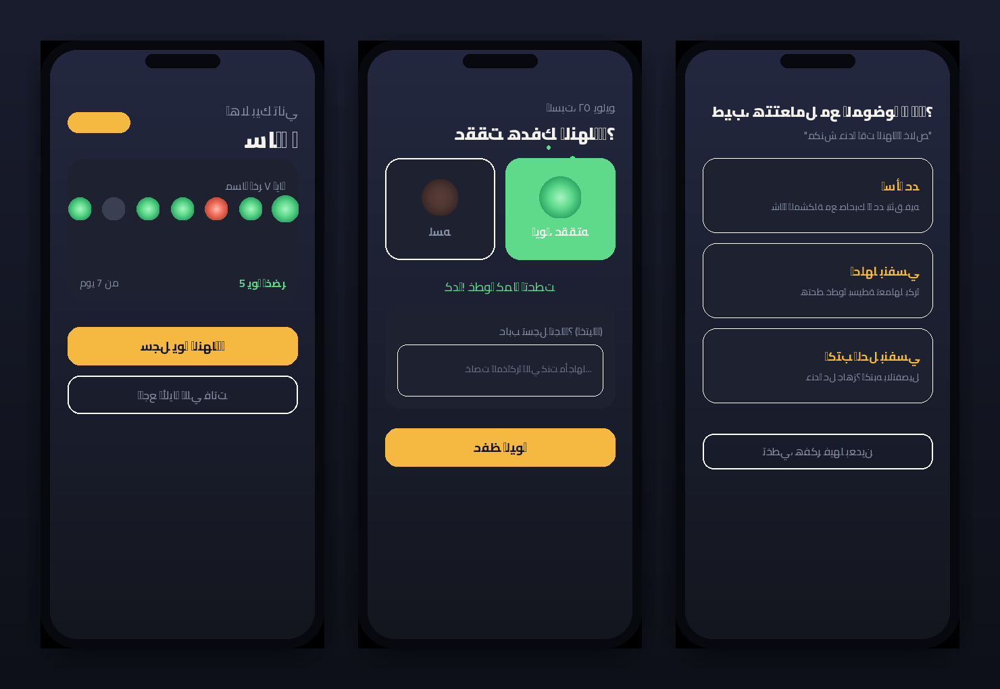
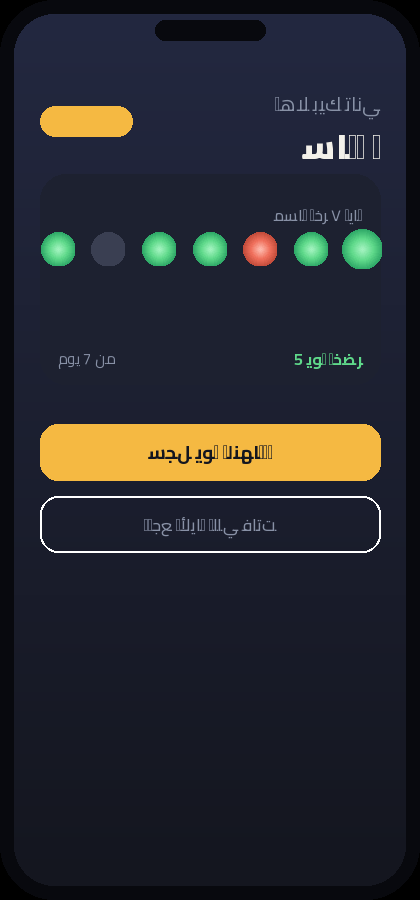
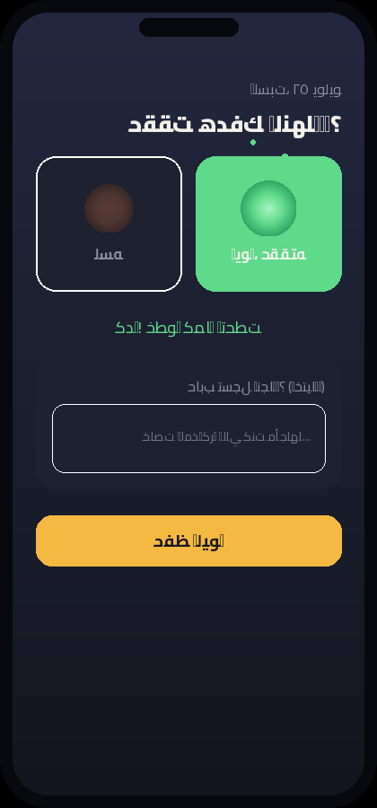
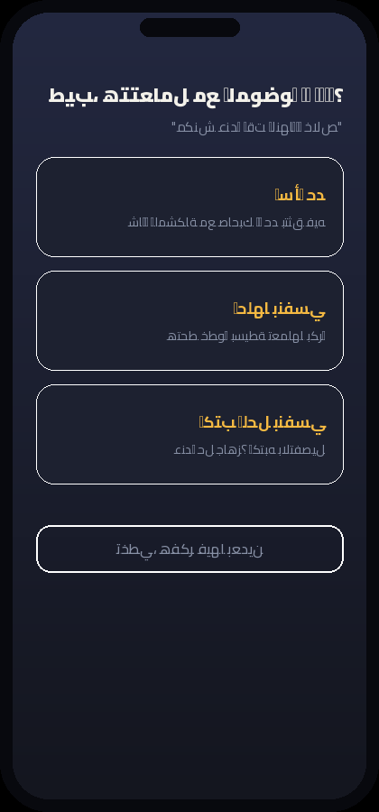

<div align="center">

# 🌗 Day Light

**كل يوم نقطة ضوء… لونها إنت اللي بتحددها**




</div>

---

## 🤔 الموقع ده بيعمل إيه بالظبط؟

معظم تطبيقات متابعة العادات بتوقفك عند سؤال واحد: **حققت هدفك النهاردة ولا لأ؟**

**Day Light** : بياخد الفكرة خطوة كمان. لما ميحصلش الهدف، بدل ما تحس إنك فشلت وخلاص، التطبيق بيسألك
- 🧩 **إيه اللي وقف قدامك بالظبط؟**
- 🛠️ **وإزاي هتتعامل مع ده؟** — تسأل حد، تحلها بنفسك، أو تكتب حل مخصوص

كل خطوة اختيارية وممكن تتخطاها، والهدف إن التطبيق يبقى مرآة صادقة ليومك، مش مجرد لون أحمر أو أخضر.

## ✨ المميزات

| | |
|---|---|
| 🟢🔴 | تسجيل يومي بسيط بأنميشن حي عند الاختيار (مش مجرد تلوين ساكن) |
| 🔥 | عدّاد أيام متتالية بيحفزك تكمل |
| 🧭 | رحلة حل حقيقية لما ميحصلش الهدف، مش مجرد "حاول تاني" |
| 📖 | أرشيف كامل لكل الأيام وتفاصيلها |
| 📱 | PWA — يتثبّت كأيقونة على أي جهاز (موبايل أو لابتوب) |
| 🕋 | واجهة عربية RTL بالكامل من الصفر |

## 📸 لقطات من التطبيق

<table>
<tr>
<td align="center"><br/><sub>الرئيسية</sub></td>
<td align="center"><br/><sub>تسجيل اليوم</sub></td>
<td align="center"><br/><sub>اختيار الحل</sub></td>
</tr>
</table>

## 🚀 عايز تجربه؟

### الطريقة الأسهل (من غير أي خبرة برمجية)
1. حمّل المشروع كـ ZIP من زرار **Code → Download ZIP** فوق في الصفحة دي
2. فك الضغط، وثبّت [Node.js](https://nodejs.org) لو مش موجود عندك
3. افتح Terminal / CMD جوه فولدر المشروع واكتب:
   ```bash
   npm install
   npm run build
   ```
4. هيطلعلك فولدر `dist` — اسحبه على https://app.netlify.com/drop
5. هتاخد رابط شغال خلال ثواني، وتقدر "تضيفه للشاشة الرئيسية" من موبايلك زي أي تطبيق عادي (غالبا هيفتح معاك لو شغلته من علي Edge)🎉

### للمطورين
```bash
git clone https://github.com/YOUR-USERNAME/day-light-app.git
cd day-light-app
npm install
npm run dev
```

## 🧱 التقنيات المستخدمة
`React` · `Vite` · `vite-plugin-pwa`

## 🤝 المساهمة
مفتوح المصدر بالكامل — لو عندك فكرة تضيفها (إحصائيات، أكتر من هدف في اليوم، تذكير بالحل...) افتح Issue أو ابعت Pull Request.

## 📄 الرخصة
MIT — استخدمه، عدّل عليه، وشاركه براحتك.

---

<div align="center">
<sub>لو عجبك المشروع، خليك تدّيه ⭐ يشجعني أكمل عليه</sub>
</div>
